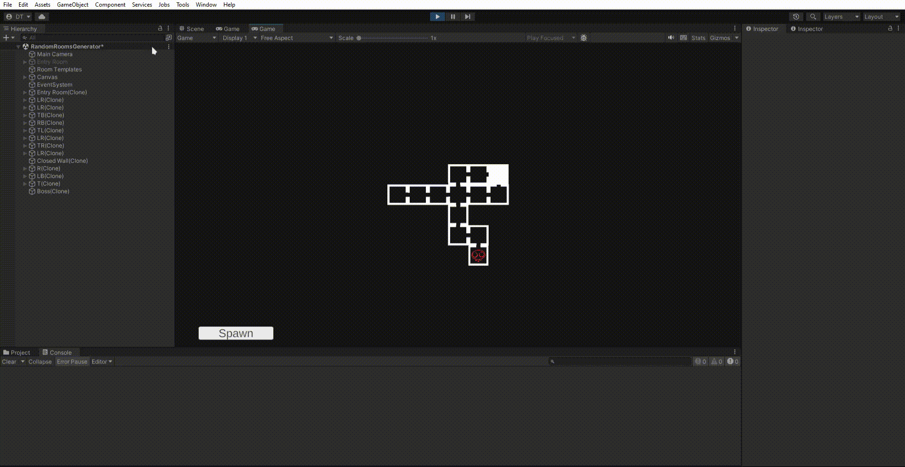
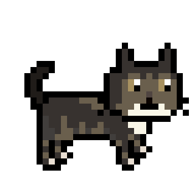

# Rage Against The Duck

## Game Description

**Rage Against the Duck** is a chaotic, nonsensical roguelite shooter inspired by the fast-paced, room-based action of The Binding of Isaac. You play as an unhinged duck on a bizarre quest for revenge, survival, and… bread.

### Gameplay

Dive into grid-based movement and directional shooting as you fight through relentless waves of enemies. Between combat arenas, procedurally generated side-rooms offer surprises, loot, and danger in equal measure. Hurl consumables, collect quirky items, and adapt your build on the fly as you push deeper into each level.

Clear all waves in the main room to open a portal that leads you to the next stage. But choose wisely:
At the end of every level, you can either return to the lobby, ending your current run but safely banking the bread you collected, or venture onward, risking everything for better rewards. Die, and you lose your entire inventory, only the bread you saved back in the lobby persists. The game autosaves every time you head back.

### Plot

The story of Rage Against the Duck is as ridiculous as it is gritty:

1. A hapless duck is flushed down a toilet and must claw its way back to the surface through sewer tunnels in search of a lake.
2. A full-blown war erupts between ducks and other animals—like chickens—because why not?
3. Mocked for being the only duck that can’t swim, our protagonist snaps. Unhinged and furious, it embarks on a violent rampage to prove itself and take revenge on every creature that ever laughed at it.

## Screenshots and videos

### Videos

|  |  |
| ------------------------ | ------------------------ |
|  |  |

### Some assets

|  |  |
| ------------------------ | ------------------------ |
|  |  |

## Commit Description

Commit message convention
The project adhere to the semantic commit convention.

<**type**>: <**description**>

- **build**: Changes that affect the build system or external dependencies
- **ci**: Changes to our CI configuration files and scripts
- **docs**: Documentation only changes
- **feat**: A new feature
- **fix**: A bug fix
- **perf**: A code change that improves performance
- **refactor**: A code change that neither fixes a bug nor adds a feature
- **style**: Changes that do not affect the meaning of the code (white-space, formatting, missing semi-colons, etc)
- **test**: Adding missing tests or correcting existing tests
- **revert**: Revert a previous commit. Please add a reference to reverted commit (Refs: a215868)

## Licence

## Authors

- [@DennisTurco](https://www.github.com/DennisTurco)
- [@Toghiri](https://www.github.com/Toghiti)

## Support

For support, email: dennisturco@gmail.com
